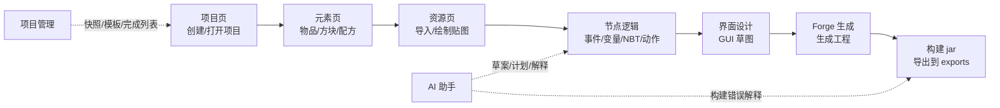
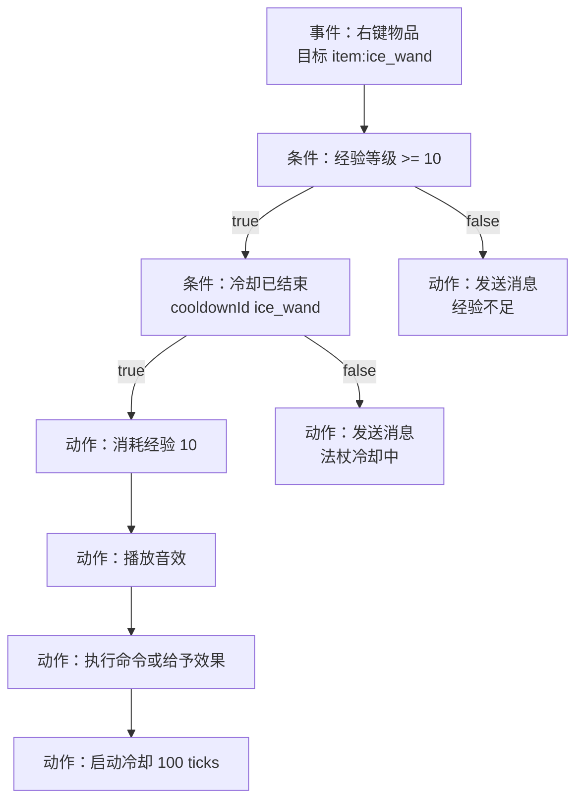

<p align="center">
  
</p>

<h1 align="center">BlockForge Studio</h1>

<p align="center">
  类似 VS Code 的 Minecraft Forge 模组桌面编辑器，把项目、元素、贴图、节点逻辑、GUI、构建和 AI 辅助放进一个工作台。
</p>

<p align="center">
  
  
  
  
</p>

<p align="center">
  <a href="#快速开始">快速开始</a> ·
  <a href="#详细教程">详细教程</a> ·
  <a href="#完整示例冰霜法杖">完整示例</a> ·
  <a href="#节点逻辑教程">节点逻辑</a> ·
  <a href="#故障排查">故障排查</a>
</p>

## 这是什么

BlockForge Studio 是一个面向 Minecraft Forge 模组制作的桌面编辑器，不是浏览器里的在线玩具。它把项目创建、元素编辑、贴图绘制、节点逻辑、GUI 草图、Forge 工程生成、本地构建、日志和 AI 辅助放在同一个窗口里，尽量让“做一个模组”的流程变成一条可以重复走通的桌面工作流。

如果你不想长期手写 Java、JSON、`mcfunction` 和各种资源目录，这个项目就是为了把这些事情收进一个更顺手的界面里。

## 界面地图

BlockForge Studio 的界面按“制作流程”组织，而不是按代码目录组织。



| 区域 | 用途 | 常用动作 |
| --- | --- | --- |
| 顶部栏 | 当前项目状态和快速构建入口 | 生成 Forge、构建 jar |
| 左侧资源栏 | 快速选择项目内容 | 打开物品、方块、节点图、界面 |
| 中间编辑区 | 主要工作区域 | 编辑表单、画贴图、搭节点 |
| 右侧属性栏 | 上下文信息和快捷操作 | 查看诊断、切换当前元素 |
| 底部面板 | 日志、诊断、IR、代码、AI 输出 | 排查错误、复制生成代码 |

设置页可以隐藏左侧、右侧和底部面板，也可以切换“舒展 / 紧凑”密度。

## 核心能力

| 模块 | 说明 |
| --- | --- |
| 项目工作台 | 创建、打开、最近项目、快照、导出、完成项目列表 |
| 元素编辑 | 物品、方块、配方、战利品表、`mcfunction` |
| 资源系统 | PNG 导入、内置像素绘制器、独立贴图窗口、资源右键管理 |
| 节点逻辑 | 事件、条件、动作、变量、NBT、IR 预览、Forge 事件代码预览 |
| GUI 草图 | 标签、按钮、图片、物品槽等基础界面模型 |
| Forge 流程 | Forge 1.20.1 工程生成、部署脚本、Gradle 构建、日志导出 |
| AI 助手 | Ollama、LM Studio、MIMO、DeepSeek、OpenAI-compatible 预设和权限开关 |

## 快速开始

### 安装依赖

```bash
npm install
npm run dev
```

直接启动桌面壳：

```bash
npm run start
```

### 本机建议环境

| 项目 | 建议 |
| --- | --- |
| Node.js | 18 或更高 |
| Java | JDK 17 |
| 系统 | Windows 优先，项目当前按 Windows 本地路径打磨 |
| Minecraft | 1.20.1 |
| Forge | 47.x |

### 第一次打开后建议做什么

1. 点“创建示例项目”，先跑通完整流程。
2. 打开“资源”页，给示例物品保存一次贴图。
3. 打开“节点逻辑”页，点“校验”和“预览 Forge 代码”。
4. 打开“Forge 生成”页，先生成工程。
5. 再构建 jar。如果失败，查看底部日志和项目 `logs/`。

## 一眼看懂的工作流

1. 先创建或打开项目。
2. 先做物品或方块，再补贴图。
3. 需要逻辑时，去节点图里搭事件、变量、条件、动作。
4. 需要界面时，去 GUI 草图里摆控件。
5. 生成 Forge 工程。
6. 构建 jar，检查日志，导出到 `exports/`。

## 完整示例：冰霜法杖

下面是一条推荐上手路线。你可以照着做一个“右键释放冰冻效果”的简单模组。

### 目标效果

玩家手持冰霜法杖右键：

1. 检查玩家经验等级是否至少 10 级。
2. 检查法杖冷却是否结束。
3. 消耗 10 级经验。
4. 播放冰霜风格音效。
5. 执行一条命令或给予附近目标效果。
6. 启动冷却。

### 需要创建的内容

| 类型 | ID 示例 | 中文名 | 用途 |
| --- | --- | --- | --- |
| 物品 | `ice_wand` | 冰霜法杖 | 玩家手持触发右键事件 |
| 方块 | `frost_block` | 霜冻方块 | 展示资源和方块生成 |
| 配方 | `ice_wand_recipe` | 冰霜法杖配方 | 让玩家能合成 |
| 战利品表 | `frost_block_loot` | 霜冻方块掉落 | 破坏方块后掉落 |
| 节点图 | `ice_wand_right_click` | 法杖右键逻辑 | 生成 Forge 事件代码 |

### 元素推荐属性

物品 `ice_wand`：

| 属性 | 推荐值 |
| --- | --- |
| 物品细分 | 法杖 / 特殊右键物品 |
| 最大堆叠 | 1 |
| 耐久 | 128 |
| 工具/武器等级 | 钻石 |
| 攻击伤害 | 4 |
| 攻击速度 | -2.2 |
| 贴图文件名 | `ice_wand` |
| 右键节点逻辑 | `item:ice_wand` |

方块 `frost_block`：

| 属性 | 推荐值 |
| --- | --- |
| 硬度 | 3 |
| 爆炸抗性 | 3 |
| 亮度 | 0 |
| 音效类型 | GLASS 或 STONE |
| 是否需要正确工具 | 是 |
| 全方块贴图文件名 | `frost_block` |

### 节点图建议



节点参数里可以使用变量，比如：

- 消息文本：`当前能量：${charge}`
- 数字参数：`var:charge`
- NBT 标签名：`blockforge_charge`

## 详细教程

### 1. 创建项目

在“项目”页填写：

- 项目目录
- 显示名称
- 模组 ID
- Java 包名
- 作者
- 描述

建议：

- 模组 ID 使用小写英文、数字和下划线，例如 `ice_wand_demo`
- 包名使用标准 Java 包格式，例如 `com.blockforge.ice_wand_demo`
- 描述尽量写清楚模组主题，后面会写进 Forge 元数据

创建后，项目会自动维护编辑目录、生成目录、导出目录和快照目录。

### 2. 创建元素

在“元素”页先做最基础的内容。

常见顺序：

1. 先做一个普通物品
2. 再做一个方块
3. 然后补配方
4. 再补掉落和函数

物品细分已经尽量做得接近模组常用习惯：

- 普通物品 / 材料
- 法杖 / 特殊右键物品
- 武器：剑
- 武器：斧
- 工具：镐
- 工具：斧
- 工具：铲
- 工具：锄
- 食物

你可以直接编辑这些常用属性：

- 中文名 / 英文名
- 贴图文件名
- 耐久
- 最大堆叠
- 攻击伤害
- 攻击速度
- 饱食度
- 饱和度
- 是否总能食用

方块也可以直接编辑：

- 硬度
- 爆炸抗性
- 亮度
- 贴图文件名
- 是否需要正确工具
- 音效类型

### 3. 导入和绘制贴图

在“资源”页你有两种方式：

#### 方式 A：导入 PNG

点击导入 PNG，然后把贴图绑定到当前物品或方块。

支持：

- 16x16
- 32x32
- 64x64

#### 方式 B：直接绘制

使用内置像素绘制器直接画图。

你可以：

- 切换画笔、橡皮、填充、取色
- 选择颜色
- 调整画布大小
- 弹出独立窗口继续画

建议：

- 先从 16x16 开始，确认轮廓
- 再放大到 32x32 或 64x64 做细节
- 保存后会自动进入资源索引

### 4. 编辑节点逻辑

在“节点逻辑”页，你可以把玩法逻辑拆成事件、条件和动作。

常用流程：

1. 先选一个事件入口，比如右键物品
2. 再添加变量
3. 再接条件节点
4. 最后接动作节点

#### 变量

节点参数支持变量引用：

- 文本里写 `${counter}`
- 数字或布尔参数里写 `var:counter`

你也可以：

- 在变量面板直接新建变量
- 在节点参数里右键插入变量
- 或者点“插变量”按钮

如果你输入一个新变量名，系统会提示你是否创建，并按当前参数类型自动生成变量。

#### NBT

NBT 标签适合保存：

- 能量
- 冷却
- 计数器
- 标记位
- 自定义字符串

首版已经把常见的“手持物品 NBT”读写接上了，后续可以继续扩展到更多目标。

#### 常见节点类型

- 事件：玩家加入、右键物品、右键方块、每刻
- 条件：经验、冷却、拥有物品、方块判断、群系判断、实体类型
- 动作：发消息、给予物品、给予效果、播放声音、召唤实体、设置方块、写入 NBT

## 节点逻辑教程

节点图是 BlockForge Studio 的核心。它的目标不是让你直接写 Java，而是把玩法逻辑拆成可检查、可预览、可生成的结构。

### 节点图的组成

| 部分 | 说明 |
| --- | --- |
| 事件节点 | 一张图的入口，例如右键物品、方块被破坏、玩家进入世界 |
| 条件节点 | 判断是否继续，例如经验是否足够、冷却是否结束 |
| 动作节点 | 真正执行的事情，例如给物品、发消息、写 NBT |
| 变量 | 临时或预留的状态数据 |
| NBT | Minecraft 物品或实体上的标签数据 |
| 连线 | 决定执行顺序 |

### 建议搭建顺序

1. 先放事件节点。
2. 再放最重要的条件节点。
3. 给条件的 true 分支接成功动作。
4. 给 false 分支接提示消息。
5. 最后补冷却、变量、NBT。

### 变量命名建议

| 用途 | 推荐命名 |
| --- | --- |
| 能量 | `charge` |
| 次数 | `counter` |
| 等级 | `level` |
| 是否激活 | `active` |
| 冷却 | `cooldown` |

变量 ID 只建议使用英文字母、数字和下划线，并且不要以数字开头。

### NBT 标签建议

为了避免和其他模组冲突，建议加上项目前缀：

| 用途 | 推荐 NBT key |
| --- | --- |
| 法杖能量 | `blockforge_charge` |
| 是否绑定 | `blockforge_bound` |
| 所属玩家 | `blockforge_owner` |
| 使用次数 | `blockforge_use_count` |

### 节点校验怎么看

如果校验失败，不要急着生成 Forge。优先看这些错误：

| 错误类型 | 可能原因 | 处理方式 |
| --- | --- | --- |
| 缺少事件入口 | 没有事件节点 | 添加右键物品或其他事件节点 |
| 变量不存在 | 参数引用了未创建变量 | 新建变量或改参数 |
| 变量重复 | 多个变量用了同一个 ID | 改成唯一 ID |
| 参数为空 | 必填参数没有填 | 打开右侧属性面板补全 |
| 连线不兼容 | 执行端口和数据端口混接 | 删除连线后重新连接 |

### 5. 预览 Forge 代码

点“校验节点图”和“预览 Forge 代码”之前，建议先看三件事：

- 事件节点有没有放进去
- 变量 id 有没有重复
- 参数有没有引用不存在的变量

如果校验通过，BlockForge 会把逻辑编译成 IR，并生成 Forge 事件代码预览。

### 什么时候看 IR

IR 是 BlockForge 的中间表示。一般用户不需要手改它，但它很适合排查：

- 节点是否按你想的顺序连上了
- 条件分支是否正确
- 参数有没有变成预期的数值或变量引用
- AI 草案转换后是否结构合理

### 6. 生成 Forge 工程

在“Forge 生成”页点生成，程序会尽量做这些事：

- 写入 `src/main/java`
- 写入 `src/main/resources`
- 生成 `mods.toml`
- 生成 `lang` 文件
- 生成物品和方块模型
- 生成 `blockstates`
- 生成资源绑定和部署命令

如果你勾选了自动构建，生成后会继续跑构建流程。

### 7. 构建 jar

构建时会先：

- 创建快照
- 检查 Java 版本
- 运行 Gradle
- 保存日志
- 成功后把 jar 复制到 `exports/`

推荐 JDK：

- 17

如果构建失败，先看 `logs/` 里的完整日志，再看 Gradle 输出。

## 设置页怎么用

设置页里有几个很实用的开关。

### 外观

- 背景颜色默认白色
- 支持手动改色
- 支持舒展 / 紧凑两种界面密度
- 支持显示或隐藏左侧资源栏、右侧属性栏、底部日志栏

### 构建

- 生成 Forge 工程后自动构建 jar

### AI 权限

默认是受控的。可以单独开关：

- AI 对话
- 读取项目上下文
- 生成节点草案
- 生成工程变更计划
- 直接应用工程变更计划

这样你可以把 AI 保持在“帮你想、帮你写草案”的位置上，而不是直接冲进工程里改文件。

## AI 预设

当前预设包括：

- Ollama
- LM Studio
- MIMO
- DeepSeek

如果你在用本地免费模型，建议先：

```bash
ollama pull qwen2.5-coder:7b
ollama serve
```

MIMO 预设可以直接改接口地址和模型名，适配本地或 OpenAI-compatible 服务。

### AI 推荐用法

| 你想做什么 | 推荐入口 | 原因 |
| --- | --- | --- |
| 问构建错误是什么意思 | 免费 AI 对话 | 不会改项目，只解释日志 |
| 让 AI 设计一个右键逻辑 | 节点草案 | 输出可校验的节点 JSON |
| 让 AI 批量补项目内容 | AI 工程大改 | 先给变更计划，再确认应用 |
| 让 AI 直接改 Java | 不推荐 | 当前目标是可视化生成和受控计划 |

### 节点草案提示词示例

可以这样写：

```text
右键冰霜法杖时，如果玩家经验等级至少 10 级并且冷却结束，就消耗 10 级经验，播放冰霜音效，发送“冰霜释放”，然后进入 5 秒冷却。否则提示经验不足或冷却中。
```

更稳定的写法：

```text
事件：右键物品 item:ice_wand。
条件 1：玩家经验等级至少 10。
条件 2：cooldownId 为 ice_wand 的冷却已结束。
成功动作：消耗经验 10，播放 minecraft:block.amethyst_block.chime，发送消息“冰霜释放”，启动 100 ticks 冷却。
失败动作：发送中文提示。
只返回 logic_graph_draft JSON。
```

### 工程大改提示词示例

```text
检查当前 BlockForge 项目，优化物品和方块的中文描述，补全缺失贴图引用，给已有节点图补清晰备注。不要删除已有元素，不要修改 generated/forge。
```

应用前请看清楚：

- 变更文件数量
- 风险等级
- 每个文件的修改原因
- 是否涉及删除

确认后应用会自动创建快照。

## 常见操作

### 右键变量

在节点参数输入框上右键，可以直接插入变量。  
这对字符串、数字、布尔参数都适用。

### 复制和删除资源

资源列表支持右键复制、删除、绑定和打开路径。

### 保存当前工作

建议在修改较多后手动保存一次，尤其是：

- 贴图编辑后
- 节点图改动后
- AI 应用前
- 构建前

### 完成项目列表

“项目管理”里有完成项目列表，适合记录已经做完或正在打磨的模组。

## Forge 生成细节

生成 Forge 工程时，会尽量把编辑态内容变成标准工程结构。

| 编辑态内容 | 生成位置 |
| --- | --- |
| 项目信息 | `generated/forge/src/main/resources/META-INF/mods.toml` |
| 物品注册 | `generated/forge/src/main/java/.../registry/ModItems.java` |
| 方块注册 | `generated/forge/src/main/java/.../registry/ModBlocks.java` |
| 创造模式标签 | `generated/forge/src/main/java/.../registry/ModCreativeTabs.java` |
| 语言文件 | `generated/forge/src/main/resources/assets/{modid}/lang/` |
| 物品模型 | `generated/forge/src/main/resources/assets/{modid}/models/item/` |
| 方块模型 | `generated/forge/src/main/resources/assets/{modid}/models/block/` |
| 方块状态 | `generated/forge/src/main/resources/assets/{modid}/blockstates/` |
| 贴图 | `generated/forge/src/main/resources/assets/{modid}/textures/` |
| 函数 | `generated/forge/src/main/resources/data/{modid}/functions/` |
| 配方 | `generated/forge/src/main/resources/data/{modid}/recipes/` |
| 战利品表 | `generated/forge/src/main/resources/data/{modid}/loot_tables/` |

### 生成前检查清单

- 项目已经保存
- 物品和方块 ID 都是合法英文 ID
- 贴图文件名不带 `.png`
- 资源已经绑定到对应元素
- 节点图校验没有错误
- Java 建议使用 JDK 17

### 构建后看哪里

| 文件夹 | 用途 |
| --- | --- |
| `generated/forge/build/libs/` | Gradle 原始构建产物 |
| `exports/` | BlockForge 复制出的最终 jar |
| `logs/` | 构建日志 |
| `editor/snapshots/` | 构建前快照 |

## 目录结构

大致会生成这些内容：

- `editor/`：编辑态数据
- `generated/forge/`：Forge 工程
- `exports/`：导出的 jar
- `logs/`：构建日志
- `editor/snapshots/`：快照

## 故障排查

### 构建失败

先检查：

1. Java 是否是 17
2. 网络镜像是否可用
3. Gradle 日志里具体缺哪个依赖
4. 是否有资源路径错误

#### 常见构建问题

| 现象 | 可能原因 | 解决方法 |
| --- | --- | --- |
| Gradle 拉不下依赖 | 镜像不可用或网络抖动 | 重试，或切换可用镜像 |
| Java 版本不对 | 不是 JDK 17 | 安装 JDK 17，并放到 PATH 前面 |
| Forge 生成成功但 jar 没有 | 构建失败或导出目录不可写 | 看 `logs/` 和 `exports/` |
| 代码预览里有 TODO | 节点类型暂不支持 | 先改成支持的节点，或后续扩展 |

### 节点校验失败

常见原因：

- 变量不存在
- 变量 id 重复
- 参数类型不对
- 没有事件节点入口

#### 节点问题对照

| 现象 | 可能原因 | 解决方法 |
| --- | --- | --- |
| 变量参数报错 | 没有创建变量 | 先在变量面板创建 |
| `var:xxx` 无效 | 参数类型不匹配 | 数字/布尔参数用 `var:`，文本用 `${}` |
| NBT 标签不合法 | key 里有奇怪字符 | 改成英文、数字、下划线、点、冒号、短横线 |
| 条件没有走到动作 | 连接到 false 分支 | 检查连线方向 |

### AI 没响应

先检查：

- 服务地址
- 模型名
- API Key
- 权限开关
- 本地服务是否真的启动

### 贴图问题

| 现象 | 可能原因 | 解决方法 |
| --- | --- | --- |
| 贴图没显示 | 没有绑定到元素 | 检查资源页的绑定字段 |
| 贴图尺寸不对 | 不是正方形 PNG | 使用 16x16、32x32 或 64x64 |
| 贴图看起来模糊 | 尺寸太小 | 放大画布后重画更清楚 |
| 纹理窗口没打开 | 还是内嵌模式 | 点击弹出独立窗口 |

## 开发说明

- 这是桌面应用，不是网页应用
- 目标主线是 Forge 1.20.1
- Fabric 结构保留，但不是首版重心
- AI 大改动走计划，不直接硬写

## 你可以直接照抄的项目骨架

如果你想快速做一个例子，可以先照这个骨架：

| 内容 | 示例 |
| --- | --- |
| 模组名 | 冰霜法杖 |
| 模组 ID | `ice_wand_demo` |
| 主物品 | `ice_wand` |
| 方块 | `frost_block` |
| 核心逻辑 | 右键消耗经验并进入冷却 |
| 资源风格 | 冷色、冰晶、浅蓝粒子 |
| AI 用法 | 只生成节点草案，不直接改 Java |

## 状态

这个项目仍在持续完善中。当前优先级是把“能跑、能做、能看懂、能回退”继续做扎实。
