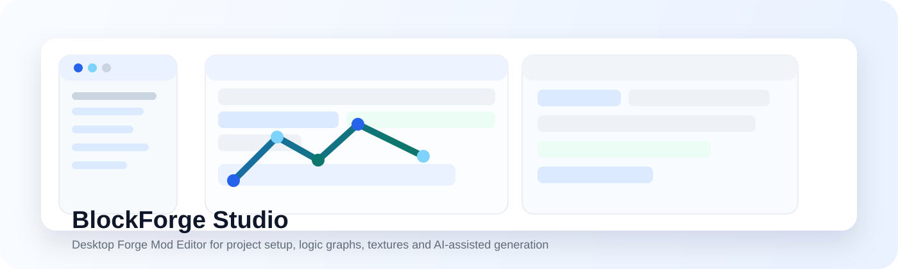

<p align="center">
  
</p>

<h1 align="center">BlockForge Studio</h1>

<p align="center">
  类似 VS Code 的 Minecraft Forge 模组桌面编辑器，把项目、元素、贴图、节点逻辑、GUI、构建和 AI 辅助放进一个工作台。
</p>

<p align="center">
  
  
  
  
</p>

## 项目定位

BlockForge Studio 面向想做 Minecraft Forge 模组、但不想长期手写 Java 和 JSON 的创作者。它提供中文表单、像素画布、节点图、NBT 编辑入口、Forge 工程生成和可控 AI 工作流，让模组制作更像使用一套完整桌面软件。

## 亮点

| 模块 | 能力 |
| --- | --- |
| 项目工作台 | 创建、打开、最近项目、快照、导出和完成项目列表 |
| 元素编辑 | 物品、方块、配方、战利品表、`mcfunction` |
| 资源系统 | PNG 导入、内置像素绘制器、独立贴图窗口、资源右键管理 |
| 节点逻辑 | 事件、条件、动作、变量、NBT、IR 预览、Forge 事件代码预览 |
| GUI 草图 | 标签、按钮、图片、物品槽等基础界面模型 |
| Forge 流程 | Forge 1.20.1 工程生成、部署脚本、Gradle 构建、日志导出 |
| AI 助手 | Ollama、LM Studio、MIMO、DeepSeek、OpenAI-compatible 预设和权限开关 |

## 快速开始

```bash
npm install
npm run dev
```

直接启动桌面壳：

```bash
npm run start
```

## 推荐工作流

1. 在“项目”页创建或打开项目，确认模组 ID、包名、作者和描述。
2. 在“元素”页创建物品或方块，选择物品细分，例如普通物品、食物、剑、斧、镐、法杖。
3. 在“资源”页导入 PNG，或用内置像素绘制器绘制贴图并绑定到元素。
4. 在“节点逻辑”页创建变量、添加事件节点和动作节点。
5. 使用“校验节点图”和“预览 Forge 代码”检查逻辑。
6. 在“Forge 生成”页生成工程并构建 jar。
7. 构建成功后，到 `exports/` 获取模组文件。

## AI 权限模型

AI 能力默认保持受控：

- 节点草案只允许返回 `logic_graph_draft` JSON。
- 工程大改必须先生成 `project_change_plan`。
- 应用工程变更前会弹窗确认并创建快照。
- 设置页可以单独开关对话、项目上下文读取、节点草案、工程计划和应用权限。

## 环境说明

- 当前主目标：Forge 1.20.1。
- 推荐 JDK：17。
- Fabric 结构保留，但不是首版生成重点。
- 如果构建失败，请先查看项目 `logs/` 目录中的完整日志。

## 仓库状态

这个项目仍在持续完善中，首要目标是形成“可运行、可编辑、可生成、可构建或给出清晰错误”的闭环。
